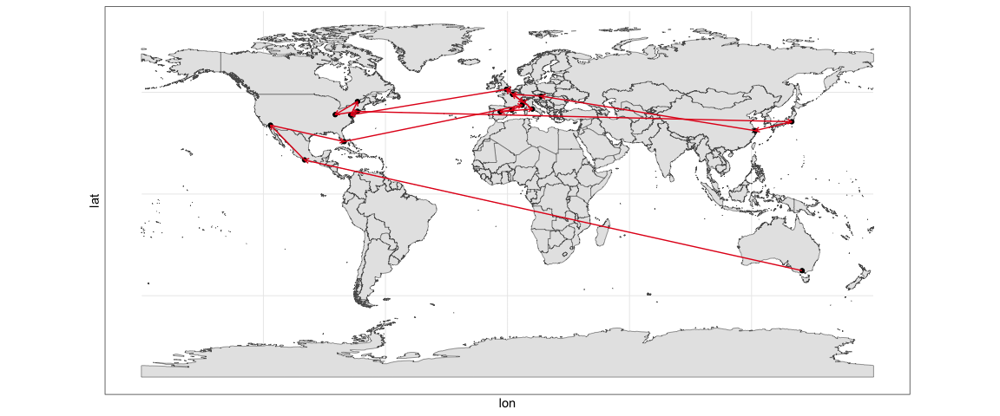
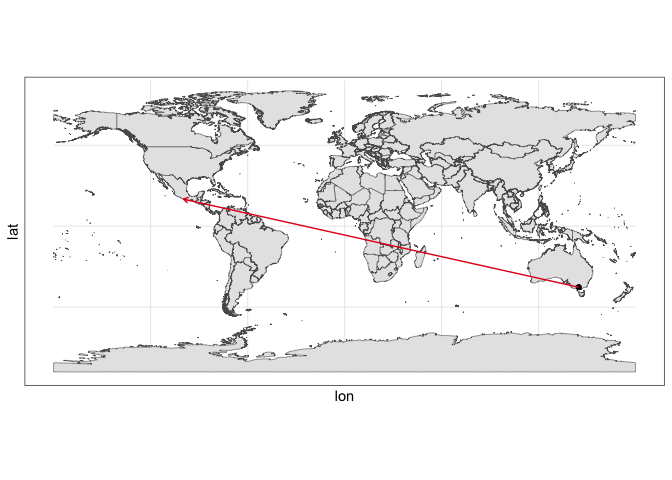
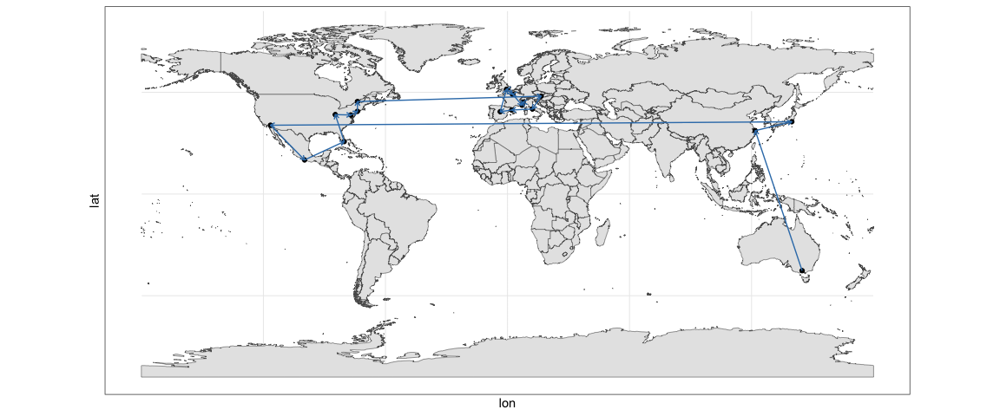
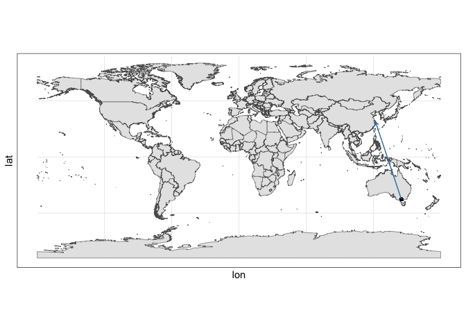
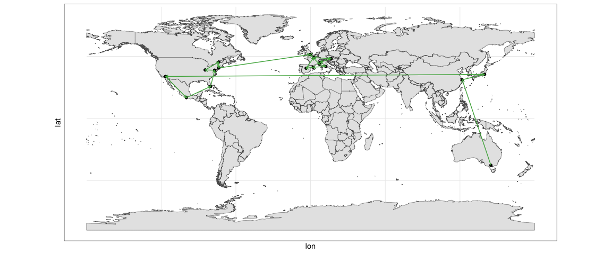
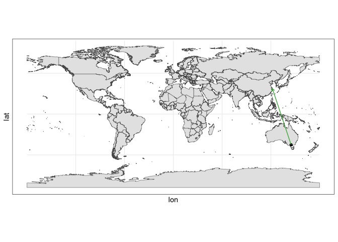

Reimagining the ATP Tour
================
Joshua Snoke
01-13-2024

## TL;DR

1)  By simply re-ordering the major events of the ATP tour, one could
    reduce the flight distance traveled and emissions produced by almost
    40%.
2)  The tour can still have the same events and cohesive sequence of
    different surfaces.
3)  This is, of course, a fantasy, but it is extremely low hanging fruit
    to realize that you could reduce the environmental impact this much
    simply by moving the dates of events without needing to change
    anything else about the tour!

### The Current Tour, Crisscrossing the Globe

The current ATP tour crisscrosses the globe numerous times, expending
incredible amounts of jet fuel. As an avid tennis fan, I have often
wonder how much this could be reduced with a re-imagined tour. The
problem is finding the shortest path between a set of points is simple
enough (<https://en.wikipedia.org/wiki/Travelling_salesman_problem>), so
let’s see what happens when we through the current tour at it.

First, a few notes and caveats.

1)  I use the ATP tour, but an equally important assessment could look
    at the WTA tour. I decided to only do one because this makes it
    simpler, and I use the ATP because currently the tournament schedule
    seems a bit more consistent (e.g., no uncertainty over tour finals,
    etc.). And hey, if we are going to reimagine the tour, why not
    imagine a world where all these tournaments are combined women and
    men. What a awesome world that would be.
2)  I limited to the tour to 20 events, in keeping with the ATP ranking
    system. Of course, incredible amounts of jet fuel are used to fly
    around to 250s all over the place, but in my imagination we could
    organize 250s in the same or neighboring cities (or cities along the
    path) to the main 20 events. Or! Maybe tennis could shrink its
    calendar and focus its effort on making a really good 20 event
    season, with space for team events in the rest of the calendar. We
    are dreaming here after all.

### Mapping the Current Tour

I kept the four majors, tour finals, nine 1000s, and six of the 500s (I
am sure some people will be mad which ones I chose but you could easily
swap a few). For location, I collected the longitude and latitudes of
the nearest major airport for each tournament city, resulting the
following list.

| level  | tournament      | surface |       lat |         lon |
|:-------|:----------------|:--------|----------:|------------:|
| major  | australian open | hard    | -37.67491 |  144.847470 |
| 500    | acapulco        | hard    |  16.76110 |  -99.756641 |
| 1000   | indian wells    | hard    |  33.82772 | -116.509725 |
| 1000   | miami           | hard    |  25.79537 |  -80.279788 |
| 1000   | monte carlo     | clay    |  43.66551 |    7.211346 |
| 500    | barcelona       | clay    |  41.29828 |    2.078680 |
| 1000   | madrid          | clay    |  40.48214 |   -3.566176 |
| 1000   | rome            | clay    |  41.80324 |   12.250241 |
| major  | roland garros   | clay    |  49.00751 |    2.550525 |
| 500    | queens          | grass   |  51.46818 |   -0.456048 |
| major  | wimbledon       | grass   |  51.46818 |   -0.456048 |
| 500    | washington      | hard    |  38.85338 |  -77.044837 |
| 1000   | montreal        | hard    |  45.46569 |  -73.746640 |
| 1000   | cincinnati      | hard    |  39.05108 |  -84.667403 |
| major  | us open         | hard    |  40.64421 |  -73.779800 |
| 500    | tokyo           | hard    |  35.54945 |  139.778755 |
| 1000   | shangai         | hard    |  31.14998 |  121.809091 |
| 500    | vienna          | indoor  |  48.11785 |   16.565521 |
| 1000   | paris           | indoor  |  49.00751 |    2.550525 |
| finals | turin           | indoor  |  45.19612 |    7.647438 |

The current tour has a lot of crisscrossing! Turns out if you flew along
the current path to all 20 tournaments, that would be roughly 62,667
kilometers! That is equal to flying around the whole earth more than one
and a half times…

### Finding a Shorter Path Between Tournaments

Now, let’s see what happens if we find the shortest path that goes
through all 20 tournaments. Using a pretty simple algorithm we find the
following optimal path:

| shortest path   | level  | surface |       lat |         lon |
|:----------------|:-------|:--------|----------:|------------:|
| australian open | major  | hard    | -37.67491 |  144.847470 |
| shangai         | 1000   | hard    |  31.14998 |  121.809091 |
| tokyo           | 500    | hard    |  35.54945 |  139.778755 |
| indian wells    | 1000   | hard    |  33.82772 | -116.509725 |
| acapulco        | 500    | hard    |  16.76110 |  -99.756641 |
| miami           | 1000   | hard    |  25.79537 |  -80.279788 |
| cincinnati      | 1000   | hard    |  39.05108 |  -84.667403 |
| washington      | 500    | hard    |  38.85338 |  -77.044837 |
| us open         | major  | hard    |  40.64421 |  -73.779800 |
| montreal        | 1000   | hard    |  45.46569 |  -73.746640 |
| vienna          | 500    | indoor  |  48.11785 |   16.565521 |
| rome            | 1000   | clay    |  41.80324 |   12.250241 |
| barcelona       | 500    | clay    |  41.29828 |    2.078680 |
| madrid          | 1000   | clay    |  40.48214 |   -3.566176 |
| wimbledon       | major  | grass   |  51.46818 |   -0.456048 |
| queens          | 500    | grass   |  51.46818 |   -0.456048 |
| roland garros   | major  | clay    |  49.00751 |    2.550525 |
| paris           | 1000   | indoor  |  49.00751 |    2.550525 |
| monte carlo     | 1000   | clay    |  43.66551 |    7.211346 |
| turin           | finals | indoor  |  45.19612 |    7.647438 |

We still have to go pretty far, but now it’s only 37,605 kilometers. We
reduced the distance flown (and emissions produced) by 40%.

### Creating a Shorter, Sensible Tour

Now, this tour does not make total sense even if it is the shortest
path, so let’s rearrange a few things. Let’s ensure that we have the
tournaments arranged by surface and that each swing ends in the
appropriate major.

1)  Starting in Australia, we have a hardcourt season that goes through
    Asia and then North America, culminating in the U.S Open. This would
    like be early-mid summer.
2)  Next, we go to Europe and have a short grass court swing and
    Wimbledon.
3)  Still in Europe we move to clay for the late-summer/early fall
    ending in Roland Garros.
4)  Finally, we end the year with some indoor tournaments and the tour
    ending finals.

Hey, that sounds pretty good. Here’s what we have:

| ideal path      | level  | surface |       lat |         lon |
|:----------------|:-------|:--------|----------:|------------:|
| australian open | major  | hard    | -37.67491 |  144.847470 |
| shangai         | 1000   | hard    |  31.14998 |  121.809091 |
| tokyo           | 500    | hard    |  35.54945 |  139.778755 |
| indian wells    | 1000   | hard    |  33.82772 | -116.509725 |
| acapulco        | 500    | hard    |  16.76110 |  -99.756641 |
| miami           | 1000   | hard    |  25.79537 |  -80.279788 |
| washington      | 500    | hard    |  38.85338 |  -77.044837 |
| cincinnati      | 1000   | hard    |  39.05108 |  -84.667403 |
| montreal        | 1000   | hard    |  45.46569 |  -73.746640 |
| us open         | major  | hard    |  40.64421 |  -73.779800 |
| queens          | 500    | grass   |  51.46818 |   -0.456048 |
| wimbledon       | major  | grass   |  51.46818 |   -0.456048 |
| monte carlo     | 1000   | clay    |  43.66551 |    7.211346 |
| rome            | 1000   | clay    |  41.80324 |   12.250241 |
| barcelona       | 500    | clay    |  41.29828 |    2.078680 |
| madrid          | 1000   | clay    |  40.48214 |   -3.566176 |
| roland garros   | major  | clay    |  49.00751 |    2.550525 |
| paris           | 1000   | indoor  |  49.00751 |    2.550525 |
| vienna          | 500    | indoor  |  48.11785 |   16.565521 |
| turin           | finals | indoor  |  45.19612 |    7.647438 |

Having moved a few tournaments around to get the majors at the end of
each swing, we have to fly 38,555 kilometers. That’s not a whole lot
more than the shortest path. And still a reduction of 38% in
km/emissions from the current tour!

Some might critique this order for ignoring weather, but I believe it is
entirely possible. The biggest challenge would be the North American
tournaments in colder areas, but if you started a little later you could
probably get the coldest ones into May/June and still have plenty of
time for the Europe swing.

### Final Thoughts

This little exercise was not rocket science, but that is possibly the
most important point. The ATP tour (and tennis in general) simply does
not need to cross the globe as much as it does. Without changing any of
the main tournaments, we could reduce the distance flown by 38%(!)
simply by rearranging the order. This is what they call “low hanging
fruit.”

I’m sure someone could tweak this, and I’m interested to hear comments
or possible improvements. But at the end of the day, even I was amazed
to see just how easily you could reduce the waste of flying around the
globe by reordering the tour, while keeping its fundamental structure
the same.

| current path    | shortest path   | ideal path      |
|:----------------|:----------------|:----------------|
| australian open | australian open | australian open |
| acapulco        | shangai         | shangai         |
| indian wells    | tokyo           | tokyo           |
| miami           | indian wells    | indian wells    |
| monte carlo     | acapulco        | acapulco        |
| barcelona       | miami           | miami           |
| madrid          | cincinnati      | washington      |
| rome            | washington      | cincinnati      |
| roland garros   | us open         | montreal        |
| queens          | montreal        | us open         |
| wimbledon       | vienna          | queens          |
| washington      | rome            | wimbledon       |
| montreal        | barcelona       | monte carlo     |
| cincinnati      | madrid          | rome            |
| us open         | wimbledon       | barcelona       |
| tokyo           | queens          | madrid          |
| shangai         | roland garros   | roland garros   |
| vienna          | paris           | paris           |
| paris           | monte carlo     | vienna          |
| turin           | turin           | turin           |
